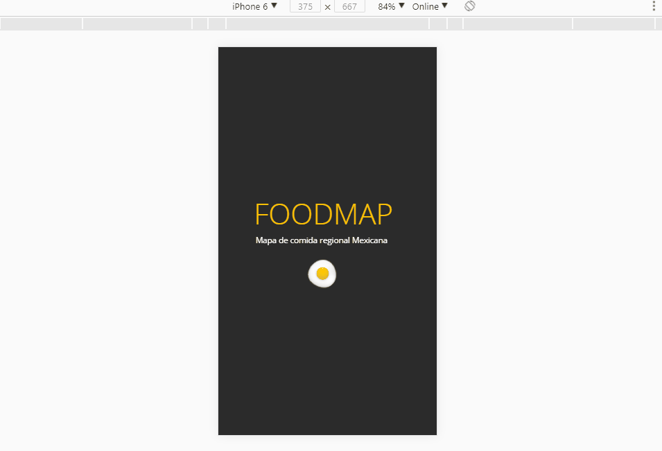
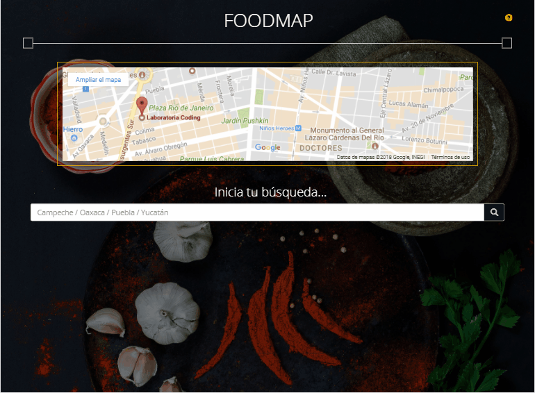
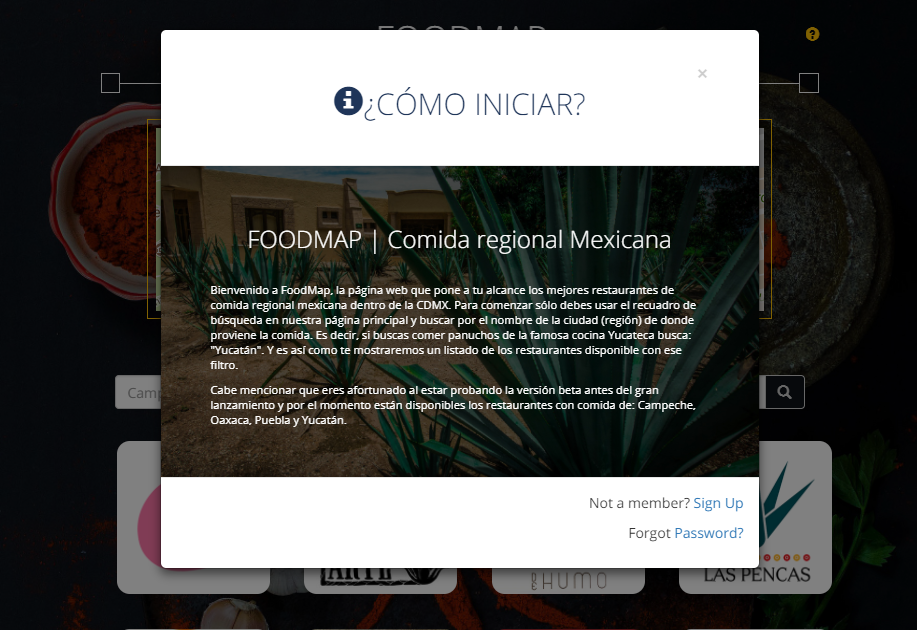
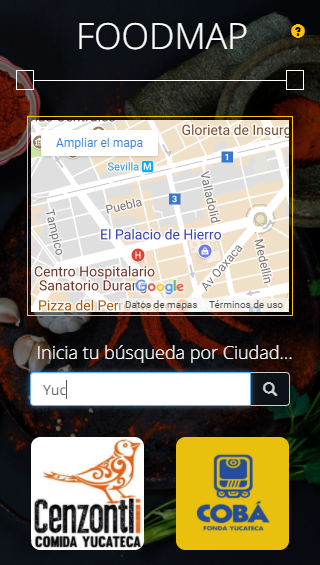
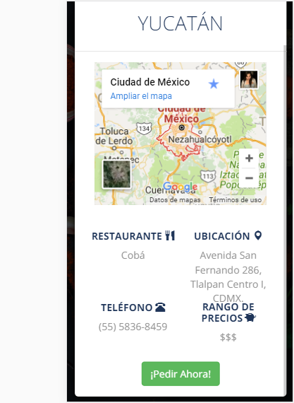

# F O O D M A P
Ejercicio de creación de una *web-app* que filtra restaurantes en el área de la Ciudad de México.
- Sprint 3 Laboratoria | Unidad 3

### Resultados
###### CONFORME A REQUERIMIENTOS
Vista *splash* con duración de 3 segundos; se muestra el título "FOODMAP: Comida regional mexicana", acompañada de la ilustración de un huevo "estrellado" y en el fondo una imágen de agaves. Se desvanece con un efecto *fade-out* que al finalizar direcciona a la vista principal de la web-app.

El sitio es funcional y adaptable a diferentes tamaños de dispositivo. Se han eligido imágenes que transmitan pasión por la cocina tradicional mexicana, ingredientes y utencilios mexicanos como el molcajete.

Al situarse dentro de la vista principal, encontramos de lado superior derecho, un icono de ayuda, que nos despliega una breve introducción al producto con el objetivo de facilitar al usuario de la aplicación comprender nuestra propuesta y objetivo. El cual es ofrecer un servicio de búsqueda de restaurantes de comida regional mexicana en la Ciudad de México, por la ciudad de dónde proviene el tipo de comida.

Iniciando la interacción con el sitio, encontramos debajo del encabezado con título, un mapa con nuestra ubicación actual *(Laboratoria Coding)*. Seguido de ello, encontramos un recuadro de recepción de texto, en el cual se encaminan los criterios de filtración de la página. Los cuales son: Campeche, Oaxaca, Puebla y Yucatán.  

  

Por defecto se muestran las imágenes con los logotipos de todos los restaurantes dentro de la base de datos. Al colocar el cursor del mouse sobre las imágenes, ya se puede observar de qué región es el tipo de comida del restaurante.

Buscando facilitar la tarea de búsqueda de nuestro usuario, se ha habilitado la función de búsqueda inteligente. Al comenzar a ingresar el nombre de la ciudad, comenzará a observar únicamente los restaurantes que cumplen con el criterio y al seleccionar alguno de ellos, se muestra la información de este a través de un modal.

Una vez cerrado el modal volvemos a la vista principal.
